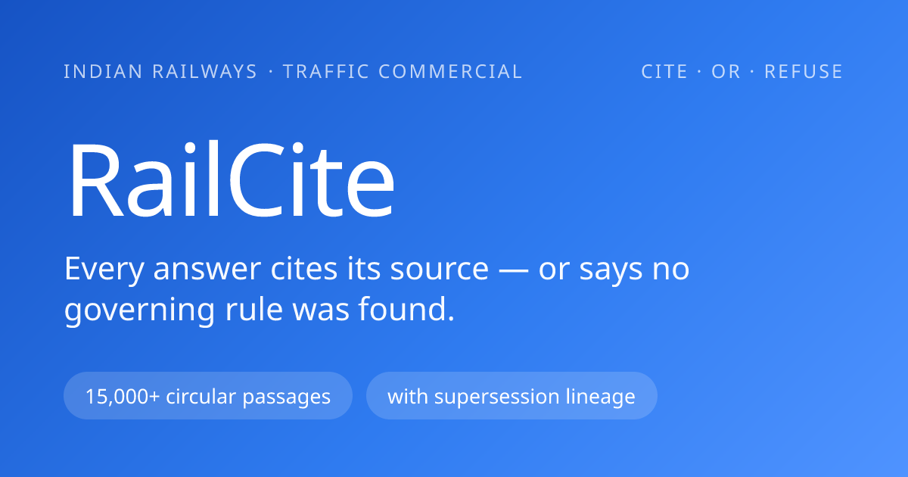
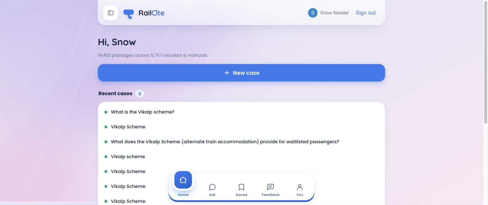
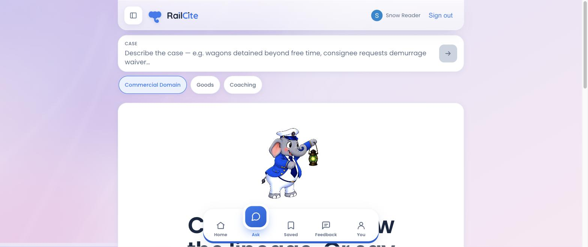
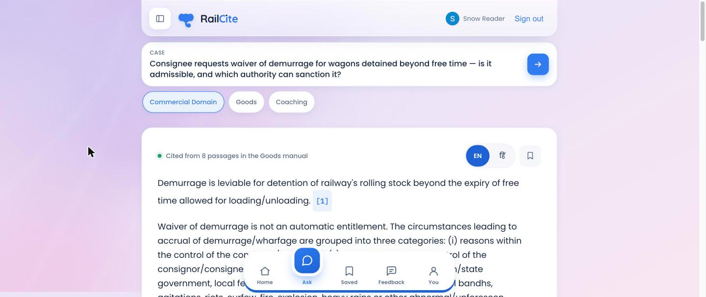
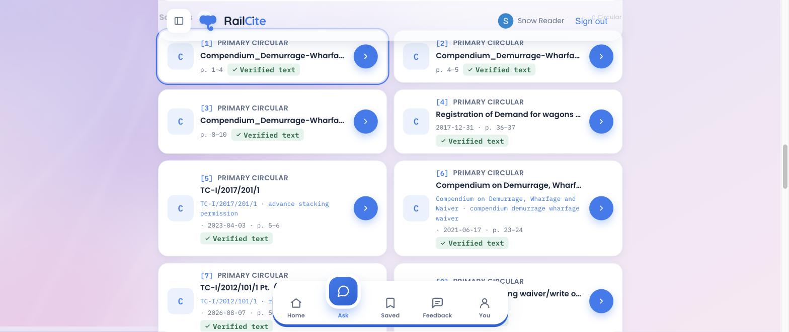
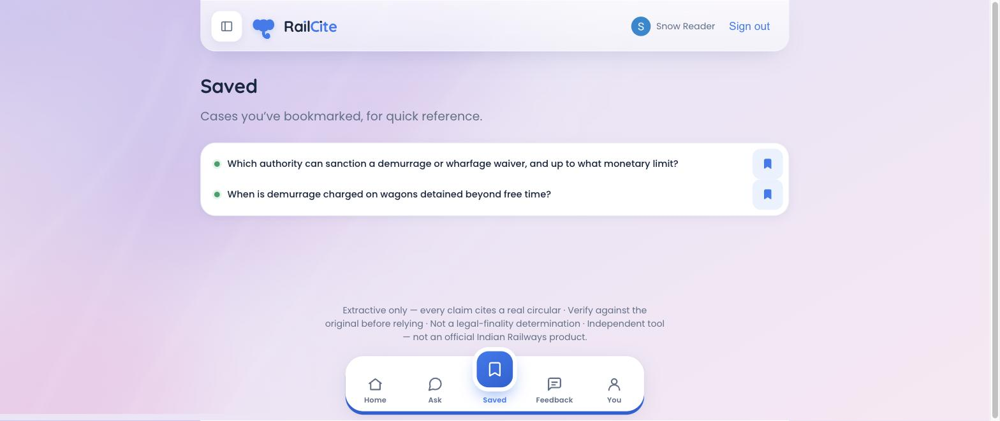

<p align="center">
  
</p>

<p align="center"><strong>Cite the rule. Show the lineage. Or say there isn't one.</strong></p>
<p align="center">A self-hosted research assistant that answers Indian Railways commercial-rule questions <em>only</em> with cited circulars &amp; manuals — and refuses when no rule governs.</p>

<p align="center">
  
  
  
</p>

---

**RailCite** is a trust-first tool for a railway **Chief Commercial Inspector** who must justify a
commercial decision — a demurrage/wharfage waiver, a refund, a freight rating — by citing the exact
circular that governs it, and defend that citation in audit. The public archive is un-searchable and
mostly scanned, and a rule can be quietly superseded. RailCite ingests the real archive, answers a
case with **numbered citations to actual passages**, shows the **supersession lineage** of the
governing rule, drafts a **paste-ready justification note** — and when nothing covers the case, it
says **"no governing rule found"** rather than inventing one. The running instance indexes **14,402
passages across 5,757 circulars & manuals**. Every claim is extractive and validated against its
source before it renders.

## Highlights

- **Cite-or-refuse answers** — every claim carries a numbered citation to a real passage; below a
  calibrated relevance threshold the tool returns *"No governing rule found"* instead of guessing.
  A **P0 citation validator** drops any claim it can't resolve to a real circular before rendering.
- **Source traceability** — a Sources panel lists each cited passage with its **circular number,
  date, page reference, and a "Verified text" badge**; OCR-recovered sources are flagged
  *"verify against original."*
- **Supersession lineage** — hand-curated `supersedes` / `superseded-by` links render as a timeline,
  so you cite the version actually in force — not one that was quietly repealed.
- **Drafted justification note** — assembles a paste-ready, cited note in a CCI's file format; the
  "Ref:" line is rebuilt from real source data, never model prose. Copy or export.
- **Domain scoping + verified-only** — restrict retrieval to **Goods** or **Coaching**, or exclude
  OCR sources, enforced as **hard SQL filters** so a Goods query can never surface a Coaching passage.
- **Full-text RAG over the real archive** — Voyage embeddings + Postgres **pgvector** cosine search
  over thousands of ingested circulars & manuals, with **Tesseract OCR** recovering scanned PDFs.
- **Per-segment English ↔ Hindi** — toggle any answer or justification-note segment between English
  and Hindi (Devanagari-safe), kept index-aligned so the two never drift.
- **Saved cases & history** — Google sign-in, then bookmark cases and reopen them; each user sees
  only their own, enforced by row-level security.
- **Installable PWA, privacy by default** — installable app shell; analytics (Mixpanel · Clarity ·
  Vercel) run with case IDs redacted from URLs, and sign-out wipes your case from screen and storage.

## Screenshots

### Home — your corpus at a glance, and recent cases


### Ask — the cite-or-refuse console, scoped by commercial domain


### A cited answer — every claim links to a real circular


### Sources — traceable to circular number, date, page & "Verified text"


### Saved — bookmarked cases for quick reference


## Getting started

> **Prerequisites:** Node 20+, a [Supabase](https://supabase.com) project (Postgres + `pgvector`),
> an [Anthropic](https://console.anthropic.com) API key, and a [Voyage AI](https://voyageai.com) key.
> Corpus ingestion also needs `poppler` (pdftotext/pdftoppm), `tesseract`, `libpq` (psql) and
> `python3` — on macOS: `brew install poppler tesseract libpq`.

```bash
npm install
cp .env.local.example .env.local     # fill in the keys (Anthropic, Voyage, Supabase, Mixpanel)
npm run preflight                    # verify keys, binaries, and the data dir
```

Apply the schema and ingest a corpus (once):

```bash
# apply the SQL schema to your Supabase Postgres — migrations/001..006
npm run db:apply                     # runs 001_init.sql; apply 002–006 the same way
npm run ingest:local                 # extract, OCR, chunk & embed the PDFs in ./Data
npm run ingest:crawl                 # optional — crawl + ingest the policy-circular hub
```

Run the app:

```bash
npm run dev                          # http://localhost:3000
```

## How it works

- **Storage is Postgres + pgvector.** Documents, `chunks` (1024-dim embeddings with page refs),
  hand-curated `lineage`, and per-user `cases` live in Supabase. Retrieval is a single `match_chunks`
  SQL function with domain / verified-only filters; sensitive tables are locked to the service role
  and users read only their own rows (RLS).
- **One request path.** `/api/query` embeds the case (Voyage `voyage-3`) → pgvector top-k →
  Claude (`claude-sonnet-5`, forced-tool cite-or-refuse) → a **P0 validator** drops any unresolvable
  citation → the conclusion, Sources panel, lineage and drafted note are assembled. Below the
  relevance threshold it refuses instead of answering.
- **Offline ingestion.** A separate pipeline extracts text (`pdftotext`), OCRs scanned pages
  (`tesseract`), chunks with page references, embeds, and upserts — flagging OCR sources so the UI
  can badge them *"verify against original."*
- **Next.js App Router on Vercel.** Client screens (Home / Ask / Saved / You / Feedback) over dynamic
  API routes; an installable PWA; analytics are env-gated and never block the retrieval loop.

## Development

```bash
npm run dev        # dev server — http://localhost:3000
npm run build      # production build (typechecks the app)
npm run lint       # eslint
npm test           # vitest suite (228 tests)
```

Useful scripts: `npm run calibrate` (tune the refuse threshold on real cases), `npm run ask`
(CLI query harness), `npm run lineage:load` (load curated supersession links), `npm run db:smoke`
(DB connectivity check).

## Credits & license

Built on Indian Railways' **public** commercial circulars and manuals
([indianrailways.gov.in](https://indianrailways.gov.in)). The onboarding greeter is *Bholu*, Indian
Railways' guard-elephant mascot.

RailCite is an **independent tool — not an official Indian Railways product**, and its output is
**not a legal-finality determination**: it surfaces the latest instruction found plus its lineage,
and you must verify every citation against the original before relying on it.

No open-source license is included yet — treat the code as **all rights reserved** until a `LICENSE`
file is added.
